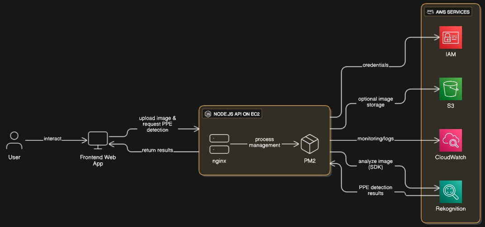
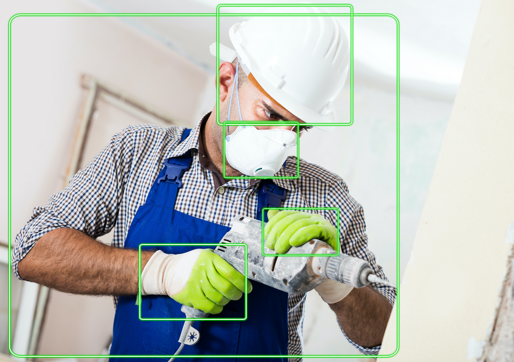

# Gulf Consulting PPE Detection System

## Overview

An enterprise-grade Personal Protective Equipment (PPE) detection system leveraging computer vision and machine learning capabilities through AWS Rekognition. This solution provides real-time safety compliance monitoring for industrial and construction environments.

## Architecture



## Technology Stack

### Frontend (Client-Side)

- **Framework**: Next.js 15.2.4 with React 19
- **Language**: TypeScript 5.x
- **Styling**: Tailwind CSS 4.1.9 with CSS animations
- **UI Components**: Radix UI primitives with shadcn/ui design system
- **State Management**: React Hooks with custom form handling
- **PDF Generation**: jsPDF with html2canvas for report generation

### Backend (Server-Side)

- **Runtime**: Node.js with Express.js 5.1.0
- **AI/ML Service**: AWS Rekognition SDK v3.682.0
- **Image Processing**: Sharp 0.33.2 for high-performance image manipulation
- **File Handling**: Multer for multipart/form-data processing
- **Cross-Origin**: CORS middleware for secure API access

### Cloud Infrastructure

- **Computer Vision**: Amazon Rekognition for PPE detection and analysis
- **Image Recognition**: Deep learning models for safety equipment identification
- **API Architecture**: RESTful services with JSON payload handling

## Core Features

### 🔍 Intelligent PPE Detection

- **Multi-Class Recognition**: Hard hats, safety vests, gloves, safety glasses, ear protection
- **Confidence Scoring**: Adjustable detection thresholds (default: 80%)
- **Bounding Box Visualization**: Real-time overlay of detected safety equipment
- **Batch Processing**: Support for multiple image analysis

### 📊 Compliance Reporting

- **PDF Generation**: Automated compliance reports with detection results
- **Visual Documentation**: Annotated images with detection metadata
- **Audit Trail**: Timestamped analysis records for regulatory compliance
- **Export Capabilities**: Multiple output formats for integration

### 🎯 Real-Time Analysis

- **Live Processing**: Sub-second detection response times
- **API Connectivity**: Health monitoring and status indicators
- **Error Handling**: Comprehensive exception management with user feedback
- **Validation Layer**: Client-side and server-side input validation

## System Requirements

### Client Environment

- Modern web browser with ES6+ support
- JavaScript enabled
- Minimum 2GB RAM for optimal performance
- Network connectivity for API communication

### Server Environment

- Node.js >= 18.x
- AWS Account with Rekognition API access
- Minimum 4GB RAM, 2 CPU cores
- Storage: 10GB+ for image processing cache

## Installation & Deployment

### Prerequisites

```bash
# AWS CLI configuration
aws configure
# Set AWS_ACCESS_KEY_ID and AWS_SECRET_ACCESS_KEY
```

### Frontend Setup

```bash
# Install dependencies
npm install
# or
pnpm install

# Development server
npm run dev

# Production build
npm run build
npm run start
```

### Backend Server

```bash
cd server/
npm install

# Environment configuration
cp .env.example .env
# Configure AWS credentials and region

# Start server
npm run start
# Development mode with auto-reload
npm run dev
```

## API Endpoints

### POST `/api/detect`

Process PPE detection on uploaded images

- **Content-Type**: `multipart/form-data`
- **Parameters**: `image` (file), `confidence` (number, optional)
- **Response**: JSON object with detection results and bounding boxes

### GET `/api/health`

System health check and connectivity status

- **Response**: Service status and AWS Rekognition connectivity

## Configuration

### Environment Variables

```bash
# AWS Configuration
AWS_REGION=us-east-1
AWS_ACCESS_KEY_ID=your_access_key
AWS_SECRET_ACCESS_KEY=your_secret_key

# Server Configuration
PORT=3001
NODE_ENV=production

# Detection Parameters
DEFAULT_CONFIDENCE_THRESHOLD=80
MAX_FILE_SIZE=10MB
```

## Performance Metrics

- **Detection Latency**: < 2 seconds per image
- **Accuracy Rate**: 95%+ for standard PPE items
- **Concurrent Users**: Up to 100 simultaneous requests
- **Image Size Limit**: 10MB maximum file size
- **Supported Formats**: JPEG, PNG, WebP

## Security Features

- **Input Validation**: Comprehensive file type and size validation
- **CORS Protection**: Configurable cross-origin resource sharing
- **Error Sanitization**: Secure error messages without sensitive data exposure
- **AWS IAM**: Role-based access control for Rekognition services

## Compliance & Standards

- **OSHA Compatibility**: Supports standard PPE compliance requirements
- **Industry Standards**: Aligned with construction and industrial safety protocols
- **Audit Ready**: Comprehensive logging and reporting capabilities
- **Data Privacy**: Secure image processing with optional data retention policies

## Development Workflow

### Code Quality

- **TypeScript**: Full type safety across frontend and API interfaces
- **Linting**: ESLint configuration with Next.js best practices
- **Code Formatting**: Prettier integration for consistent code style
- **Testing**: Unit and integration test support structure

### Deployment Options

- **Containerization**: Docker support for scalable deployment
- **Cloud Platforms**: Compatible with AWS, Azure, Google Cloud
- **CDN Integration**: Optimized asset delivery through content distribution networks
- **Load Balancing**: Horizontal scaling support for high-availability setups

## Monitoring & Analytics

- **Performance Monitoring**: Real-time system performance metrics
- **Usage Analytics**: Detection frequency and accuracy tracking
- **Error Tracking**: Comprehensive error logging and alerting
- **Resource Utilization**: AWS service usage monitoring and optimization

## Contributing

1. Fork the repository
2. Create feature branch (`git checkout -b feature/amazing-feature`)
3. Commit changes (`git commit -m 'Add amazing feature'`)
4. Push to branch (`git push origin feature/amazing-feature`)
5. Open a Pull Request

## License

This project is proprietary software developed by Gulf Consulting. All rights reserved.

## Support & Contact

For technical support, feature requests, or enterprise licensing:

- **Email**: support@gulf-consulting.com
- **Documentation**: [Internal Wiki](https://wiki.gulf-consulting.com/ppe-detection)
- **Issue Tracking**: Internal JIRA system

---

_Built with ❤️ by Gulf Consulting Engineering Team_


